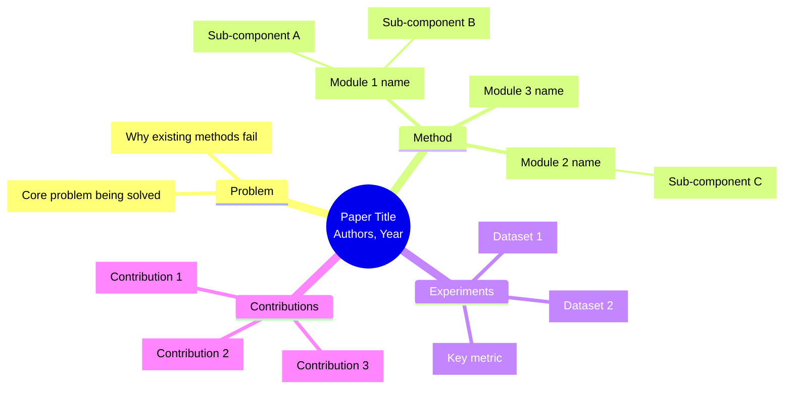
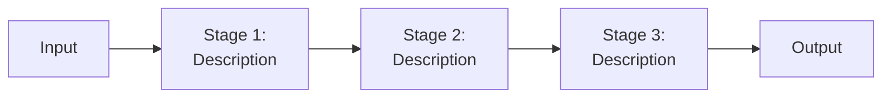
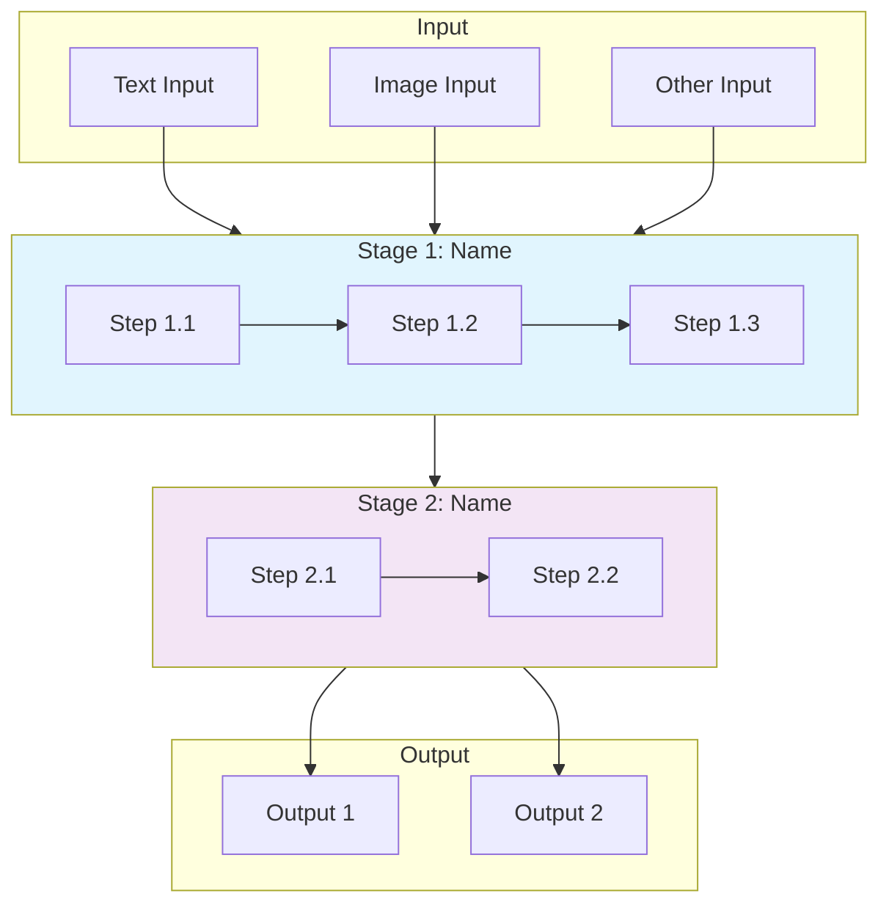
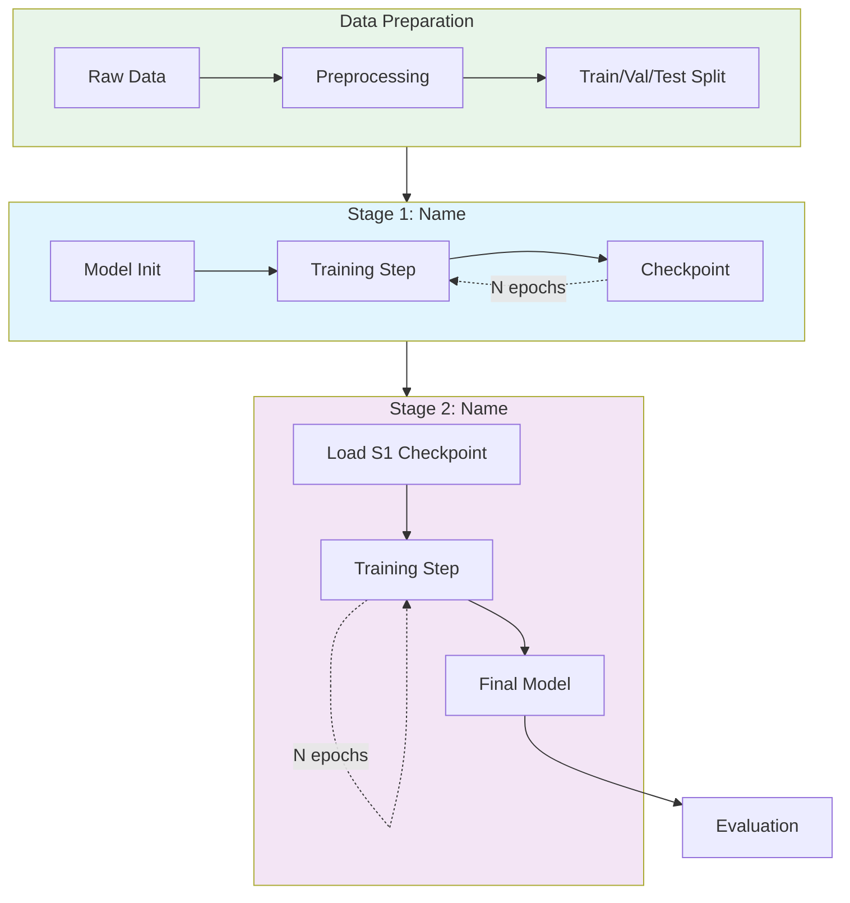
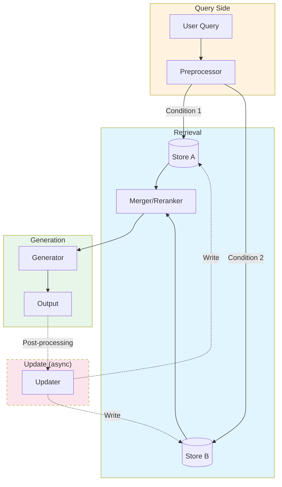
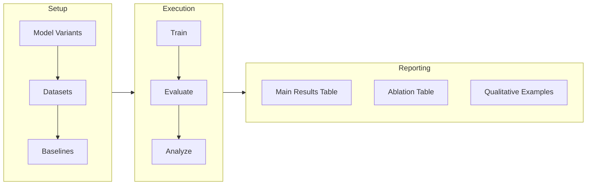
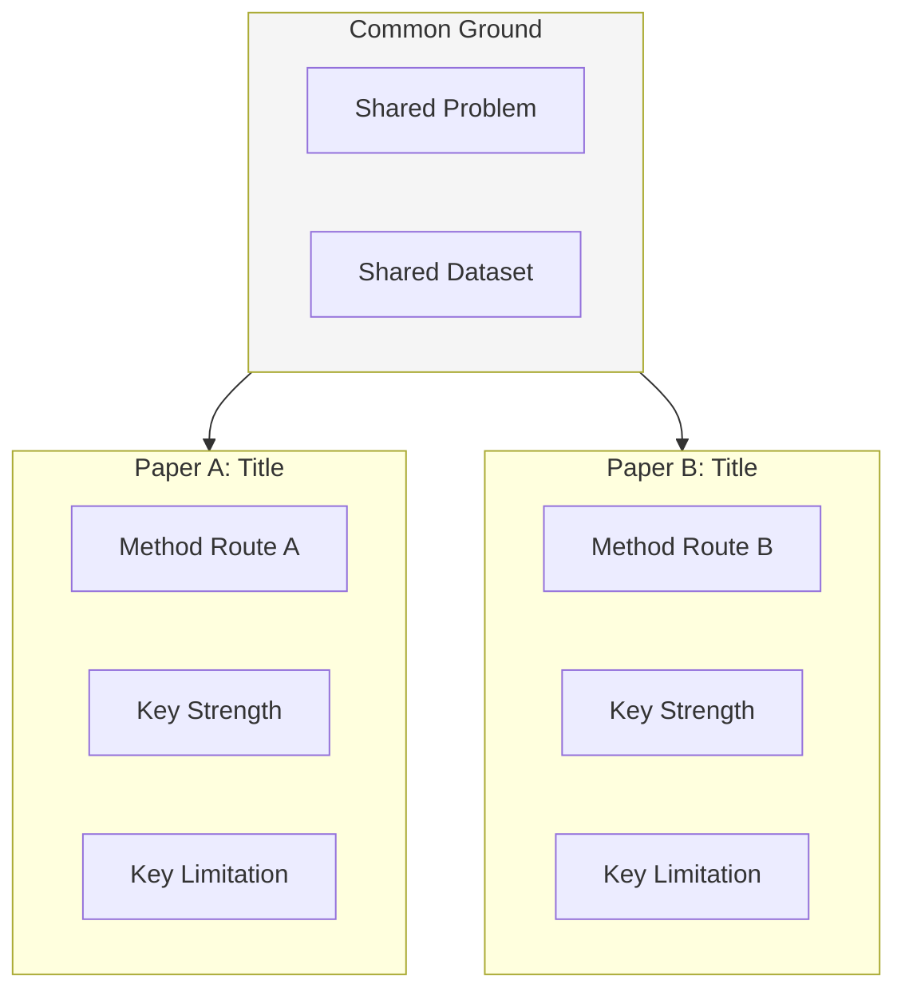
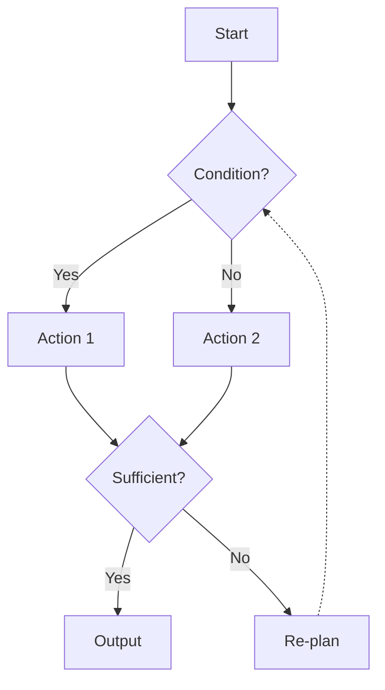

# Mermaid Diagram Templates for Paper Analysis

Use these templates as starting points. Adapt node labels and structure to the specific paper. Always wrap in ```mermaid code blocks.

---

## Template 1: Paper Overview Mindmap

Used in Deep mode at the start to give a structural overview.



**Adaptation notes**:
- If the paper has 4+ modules, group them under 2-3 category nodes
- Key metrics in the Experiments branch should include specific numbers when impressive

---

## Template 2: Method Flowchart (Pipeline/Architecture)

Used in both Skim (simplified) and Deep (full) modes. This is the most important diagram.

### Basic version (for Skim mode)



### Detailed version (for Deep mode)



**Design guidelines**:
- Use subgraphs to group related steps
- Color-code: input (green), processing (blue/purple), output (orange), memory/storage (gray)
- Label edges with data flow descriptions when non-obvious
- Show iterative/loop-back connections with dashed lines
- Show memory/database interactions with distinct node shapes `[(database)]`

---

## Template 3: Training Pipeline

Use when the training process has multiple stages or is non-trivial.



---

## Template 4: Memory / Data Flow Architecture

Use for papers with complex data storage and retrieval (RAG, memory systems, databases).



---

## Template 5: Experiment Pipeline



---

## Template 6: Comparison Matrix (for multi-paper comparison mode)



---

## Template 7: Decision / Logic Flow in Method

Use when the method involves branching logic or decision points.



---

## General Mermaid Best Practices

1. **Node labels**: Keep them short (under 50 chars). Move details to surrounding text.
2. **Direction**: 
   - Pipeline/sequential = TB (top to bottom)
   - Data flow with branches = LR (left to right)
   - Decision trees = TD
3. **Shapes**:
   - `[rectangle]` = process step
   - `{diamond}` = decision/condition
   - `[(cylinder)]` = database/storage
   - `([rounded])` = start/end
   - `((circle))` = connector
4. **Subgraphs**: Use to group logically related steps and reduce visual complexity
5. **Colors**: Use sparingly. Blue for processing, green for data, purple for model, gray for external/optional
6. **Dashed lines** (`-.->`): Use for async, optional, or iterative connections
7. **Thick lines** (`==>`) : Use for the main/happy path
8. **Always test**: If a diagram has more than 30 nodes, split into sub-diagrams
